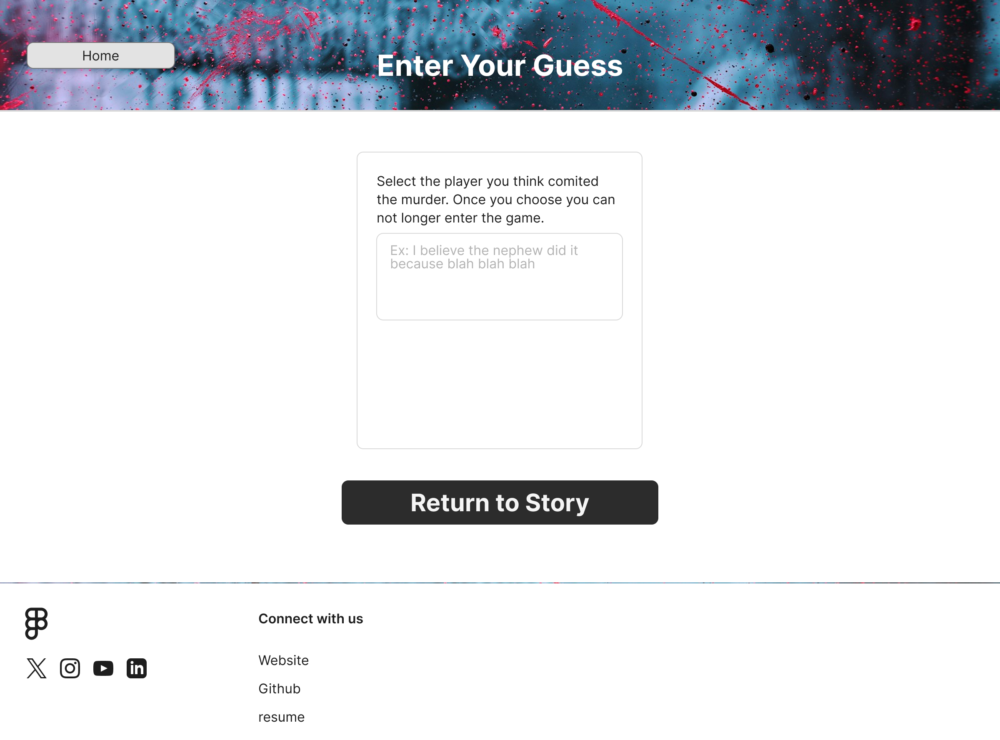
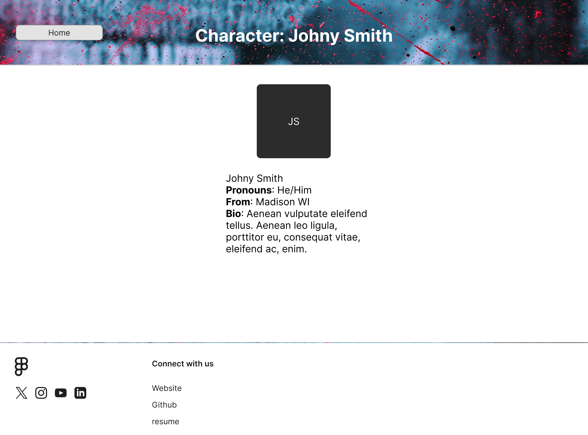
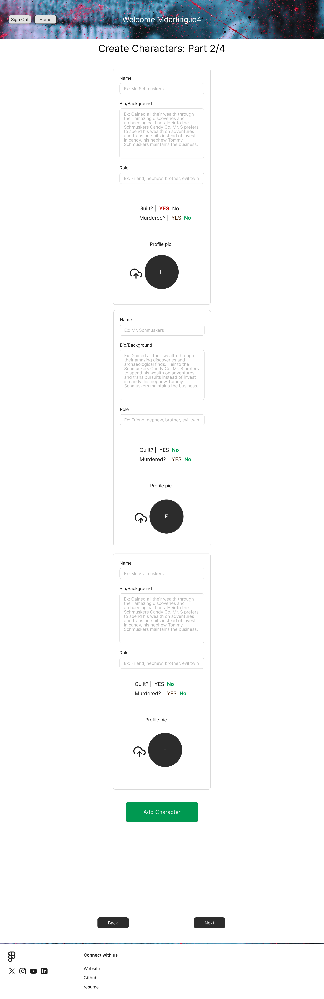
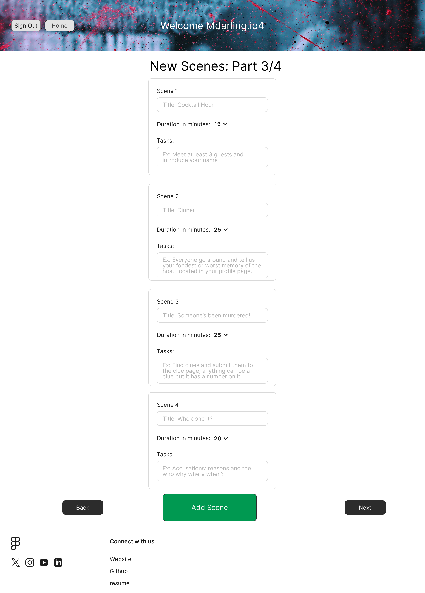
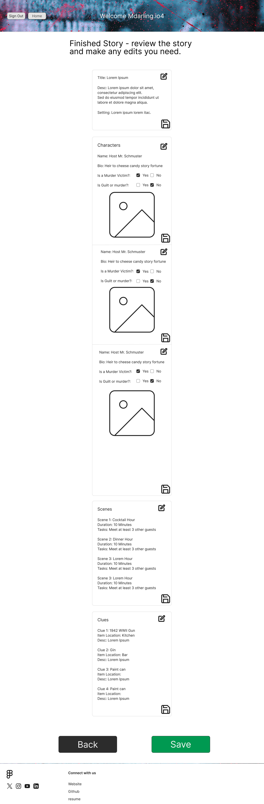

# MysteryCode (name in progress)
_Welcome to the Murder Mystery web party game, MysteryCode, an interactive storytelling and deduction app where players step into a world of secrets, suspects, and suspense. The goal is simple: uncover the truth behind a mysterious crime by collecting clues, interrogating characters, and piecing together the story. It’s designed to let players explore the story details, track evidence, and solve the mystery, while admin can create and manage new mysteries, characters, and plotlines._

  
<b>Technology used</b>

- JSP/Servlet with Hibernate for front end
- Java for backend application development
- PostgreSQL through Supabase for storing game details (free unlike AWS)
- AWS (Elastic Beanstalk/RDS) + Cognito for auth
- Git and GitHub for version control
- Maven for dependency management and builds
- JUnit for testing
- (others?)

### Problem Statement: 
Have you ever hosted a murder mystery party before? They are quite fun, but managing to keep everyone on track with the story and having all the information easy to view for every player while also hosting and playing a character, albiet a dead one usually, is a lot of moving parts. Players will often forget character details of other players, miss out on new clues discovered, and forget to make their final guess at the end of the game. 

### Proposed Solution:
A murder mystery web app for all to use, where players can view the story, characters, and clues without raising suspicion when they forget crucial details and have to ask questions. The host will be able to create new games with details such as the story, setting, scenes, characters, and clues. As well as delete and edit details of existing stories. 

### Key features of this app:
* Players: Join a story, explore scenes, and uncover clues.
* Admins: Create and manage stories, characters, clues, and scenes. 
* Database-powered: Stories and characters are stored dynamically with Hibernate & PostgreSQL.
* Web-friendly: Built with JSP, Servlets, and styled for desktop & mobile play.
* API use: (braining storming atm) 
  * Weather api for story in game play with current weather.
  * Random story generator API.
  * QR code instead of pin for uploading a found clue.
  * Riddles API for players to solve before moving onto the next scene.

### User stories

#### Player User Stories
1. As a player I want to see my character profile so I need to have a character page with my bio, traits, and avatar.
2. As a player I want to see other characters so I need to have a list of characters with their details and relationships to the main character.
3. As a player I want to view the story in one central place so I need to have a story hub that shows the plot and current scenes.
4. As a player I want to view all discovered clues together so I need to have a clues hub that displays clue images and details.
5. As a player I want to be prompted to introduce myself at the start so I need to have a meet & greet prompt or scene to introduce myself.
6. As a player I want to make my final guess at the end so I need to have an accusation form to submit who I think the murderer is and why.
7. As a player I want to enter a clue by ID so I need to have a text box where I can punch in a clue code and reveal it for everyone.

#### Host/Admin User Stories
1. As the admin player I want to create new stories so I need to have a story builder with title, setting, and plot fields, as well as characters, clues, and scenes.\
2. As the admin/host I may need to edit the stories, clues, scenes, and characters, so I need to be able to edit, delete, and update stories that already exist.
3. As the host I want to be able to upload pictures of the hosts characters, either generate photos from an AI prompt or pictures of the actual players. And if that's not an option have photos to choose from for character profiles.
4. As the admin player I want to deploy clues manually if players can’t find some clues, so I need to have a system to display a clue for all players during the game without a player submitting the clue ID.
5. As the admin player I want to control story progression, so I need to have a way to lock/unlock scenes based on timing, player actions, button push notification.
6. As the admin player I want to review player guesses so I need to have a dashboard that shows all final accusations side by side. 
7. As the admin player I want to track overall game activity so I need to have an analytics panel showing clue unlocks, scene progression, and player engagement, and winners of the game. 
8. _A stretch:_ As an uncreative host, I want AI to generate a short story prompt for me and then I can fill in the details and take what I like when creating a new story.
9. API - As a host I want real time weather while playing the game to be incorporated somehow.

### Home Page/Index Page

#### Page Designs - Player Pages

#### Page Designs - Host Pages

#### Page Designs - Host Pages 

